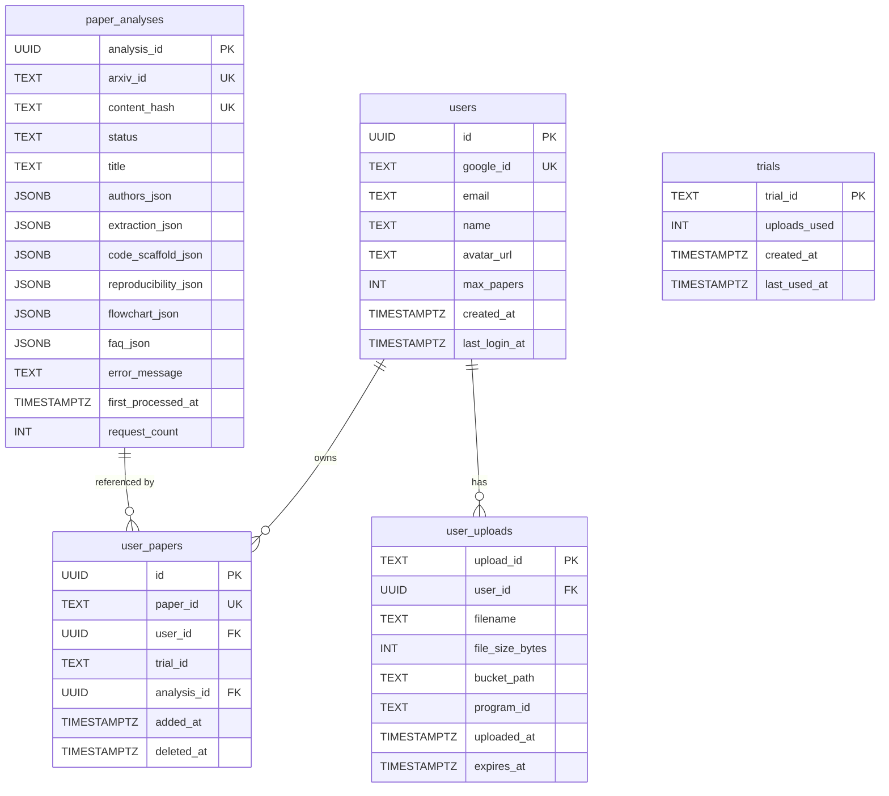
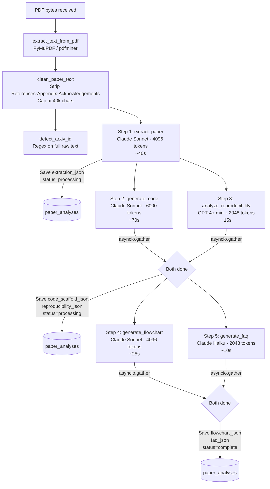
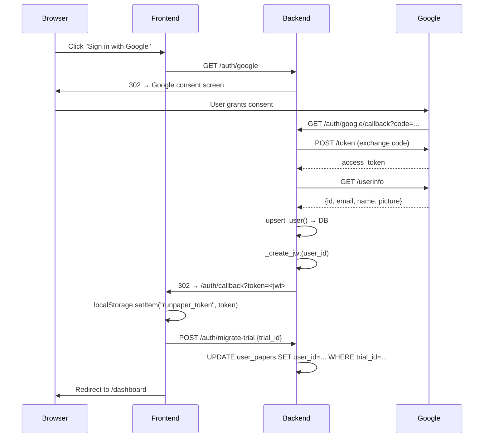
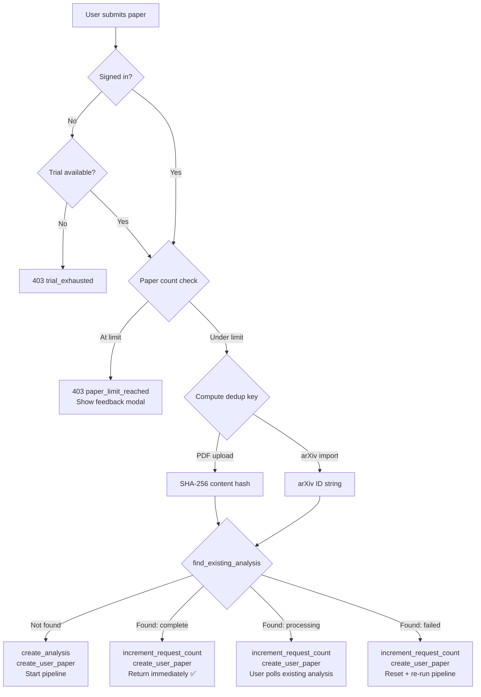

# RunPaper — Technical Documentation

> **Last updated:** April 2026  
> **Version:** 1.0  
> Upload any ML/AI research paper → get runnable PyTorch code in ~90 seconds.

---

## Table of Contents

1. [Product Overview](#1-product-overview)
2. [Architecture Overview](#2-architecture-overview)
3. [Tech Stack](#3-tech-stack)
4. [Database Schema](#4-database-schema)
5. [Analysis Pipeline](#5-analysis-pipeline)
6. [API Reference](#6-api-reference)
7. [Frontend Structure](#7-frontend-structure)
8. [Authentication & Session Management](#8-authentication--session-management)
9. [Free Trial System](#9-free-trial-system)
10. [Paper Deduplication](#10-paper-deduplication)
11. [Rate Limiting & Safety](#11-rate-limiting--safety)
12. [Error Monitoring & Reliability](#12-error-monitoring--reliability)
13. [Performance](#13-performance)
14. [Future Roadmap](#14-future-roadmap)

---

## 1. Product Overview

RunPaper is a web tool for ML engineers and researchers. You upload an arXiv PDF (or paste an arXiv ID), and within ~90 seconds you get:

| Tab | What it gives you |
|---|---|
| **Learn** | Interactive ReactFlow architecture diagram. Click any node to inspect its description, LaTeX math, and the exact function that implements it. Resizable slide-over drawer. Companion mode: Code or PDF alongside. |
| **Code** | `model.py`, `train.py`, `config.yaml`, `requirements.txt` scaffold with exact hyperparameters from the paper. `# TODO` markers where the paper is ambiguous. Function navigator from flowchart annotations. Download as `.zip`. |
| **Extraction** | Structured metadata: title, authors, year, core contribution, method description, key equations (KaTeX rendered), hyperparameter table (name / value / source), dataset links. |
| **Reproducibility** | ~20-criterion checklist: ✅ explicitly stated / ❌ not specified. Covers seed, hardware, batch size, LR schedule, weight init, augmentation, data splits, and more. |
| **Chat** | Live Q&A in Direct or Socratic mode. Pre-generated FAQ chips load instantly. Responses cite code file + function and flowchart node. |
| **Paper** | Original PDF rendered inline (Supabase signed URL or arXiv fallback). |

### Access model

- **Anonymous users** — 1 free paper upload (no account required). Trial ID stored in `localStorage`.
- **Signed-in users** — up to 5 papers by default (`users.max_papers`, admin-adjustable).
- Signed-in users who hit the limit see a feedback form that emails the team and requests a limit increase.

---

## 2. Architecture Overview

```
┌─────────────────────────────────────────────────────────────┐
│                        Browser (Next.js)                     │
│  Landing · Upload · Dashboard · /papers/[id] · Settings      │
│  Auth via Google OAuth2 · JWT in localStorage                │
└──────────────────────┬──────────────────────────────────────┘
                       │  HTTPS  (REST + JSON)
┌──────────────────────▼──────────────────────────────────────┐
│                    FastAPI Backend (Python 3.11)              │
│                                                              │
│  Middleware: CORS · Rate Limiter · Request ID · Sentry       │
│                                                              │
│  Routers:                                                    │
│    auth.py    — Google OAuth2, JWT, /migrate-trial           │
│    papers.py  — upload, arxiv-import, get, list, download    │
│    chat.py    — /faq (cached), /chat (live, streaming-ready) │
│    uploads.py — Supabase Storage metadata + TTL cleanup      │
│    rag.py     — stub: future vector search                   │
│                                                              │
│  Services:                                                   │
│    papers_db.py  — paper_analyses + user_papers tables       │
│    trial_db.py   — trials table (anonymous usage tracking)   │
│    storage.py    — Supabase Storage (signed URLs, upload)    │
│    users_db.py   — users table (upsert, lookup)              │
│                                                              │
│  Pipeline modules (see §5):                                  │
│    paper_extraction · code_generation · reproducibility      │
│    flowchart · chat/faq                                      │
│                                                              │
│  llm_client.py — provider-agnostic LLM interface            │
│    Step 1,2,4: Claude Sonnet    Step 3: GPT-4o-mini          │
│    Step 5: Claude Haiku                                      │
└──────┬──────────────────┬──────────────────┬────────────────┘
       │                  │                  │
┌──────▼──────┐  ┌────────▼──────┐  ┌───────▼───────┐
│  Supabase   │  │  Supabase     │  │  LLM APIs     │
│  PostgreSQL │  │  Storage      │  │  Anthropic    │
│  (4 tables) │  │  (PDF files)  │  │  OpenAI       │
└─────────────┘  └───────────────┘  └───────────────┘
```

---

## 3. Tech Stack

| Layer | Technology | Notes |
|---|---|---|
| **Frontend** | Next.js 15 App Router | All pages `"use client"` — auth lives in localStorage |
| **Styling** | Tailwind CSS + shadcn/ui | All components from shadcn; CSS vars for theming |
| **Diagrams** | ReactFlow (`@xyflow/react`) | Architecture diagram, resizable NodeDrawer |
| **Math** | KaTeX (dynamic import, SSR-safe) | `<TexMath tex="..." display />` component |
| **Server state** | TanStack React Query | Polling every 3s during processing |
| **Backend** | FastAPI + Python 3.11 | Async throughout; APScheduler for background jobs |
| **LLM routing** | `api/llm_client.py` | Anthropic / OpenAI / Gemini; per-call `provider=` override |
| **PDF parsing** | PyMuPDF (fitz) + pdfminer fallback | Text extracted once, cleaned, reused |
| **Auth** | Google OAuth2 + python-jose JWT | 30-day JWT, stored in `localStorage` as `runpaper_token` |
| **Database** | Supabase (PostgreSQL) | PostgREST client; in-memory fallback for dev |
| **File storage** | Supabase Storage | Signed URLs (1h TTL); configurable upload TTL |
| **Scheduling** | APScheduler (AsyncIOScheduler) | Stale-paper cleanup every 5 min; file TTL cleanup every 24h |
| **Error monitoring** | Sentry | FastAPI + Starlette integrations; `ErrorBoundary` in React |

---

## 4. Database Schema

### Entity Relationship Diagram



### Table purposes

| Table | Purpose |
|---|---|
| `users` | Google OAuth users. `max_papers` is admin-adjustable per-user. |
| `paper_analyses` | **Global.** One row per unique paper (deduplicated by `arxiv_id` or SHA-256 `content_hash`). All LLM output lives here. `request_count` increments each time a new user submits the same paper. |
| `user_papers` | **Per-user.** Join table between users and analyses. `paper_id` is the URL-facing key. Soft-delete (`deleted_at`) only affects this row — the global analysis is preserved. |
| `trials` | Anonymous trial tracking. One row per `trial_id` (UUID from localStorage). `uploads_used` max 1. |
| `user_uploads` | Supabase Storage file metadata. TTL-managed by the scheduler. |

### Migrations

| File | Description |
|---|---|
| `001_runpaper_schema.sql` | `users`, `user_uploads`, `papers` (original monolithic table) |
| `002_flowchart_annotations.sql` | `ADD COLUMN flowchart_json` |
| `003_faq_column.sql` | `ADD COLUMN faq_json` |
| `004_trials.sql` | `trials` table for anonymous trial tracking |
| `005_trial_id_column.sql` | `ADD COLUMN trial_id` to papers |
| `006_arxiv_id.sql` | `ADD COLUMN arxiv_id` to papers |
| `007_dedup_schema.sql` | Creates `paper_analyses` + `user_papers`; migrates existing data; adds `users.max_papers` |

---

## 5. Analysis Pipeline

### Execution graph



### Timing breakdown

| Phase | Wall time | What becomes available |
|---|---|---|
| t = 0s | Upload received | Processing spinner |
| t ≈ 40s | Step 1 complete | **Extraction tab** |
| t ≈ 85s | Steps 2+3 complete | **Code tab, Reproducibility tab** |
| t ≈ 95s | Steps 4+5 complete | **Learn tab, Chat tab** — status = complete |

### Pipeline resilience

- **Hard timeout**: `asyncio.wait_for` wraps the entire pipeline. Default 600s, configurable via `PIPELINE_TIMEOUT_SECONDS`.
- **Stale cleanup**: APScheduler runs every 5 minutes; any analysis stuck in `processing` for >15 minutes is marked `failed`.
- **Deduplication on failure**: If a previous analysis for the same paper failed, it is reset to `processing` and re-run on the next submission.
- **Error isolation**: Steps 4 and 5 (flowchart, FAQ) have their own `try/except` and fall back to empty results rather than failing the whole pipeline.

### PDF text cleaning

`clean_paper_text()` in `pdf_reader.py` does two things before any LLM call:

1. **Section stripping**: Finds the first occurrence of a section header matching `References | Bibliography | Acknowledgements | Appendix` (case-insensitive, optional numeric prefix) and truncates there. This removes 20–40% of tokens with zero information loss for code generation.
2. **Hard cap**: Truncates to 40,000 characters. Original limit was 60,000.

---

## 6. API Reference

### Auth

| Method | Path | Auth | Description |
|---|---|---|---|
| `GET` | `/auth/google` | — | Redirect to Google OAuth2 consent screen |
| `GET` | `/auth/google/callback` | — | Exchange code → JWT, redirect to `/auth/callback?token=` |
| `GET` | `/auth/me` | Bearer JWT | Return current user |
| `POST` | `/auth/logout` | — | No-op (frontend clears localStorage) |
| `POST` | `/auth/migrate-trial` | Bearer JWT | Link anonymous trial papers to user account |

### Papers

| Method | Path | Auth | Description |
|---|---|---|---|
| `POST` | `/api/papers/upload-and-analyze` | Trial or JWT | Upload PDF, start pipeline. Returns `{paper_id, status}` immediately. |
| `POST` | `/api/papers/arxiv-import` | Trial or JWT | Body: `{arxiv_url}`. Fetches PDF from arXiv, starts pipeline. Accepts full URL, `arXiv:XXXX`, or bare ID. |
| `GET` | `/api/papers` | Optional JWT | List non-deleted papers for the current user (or trial). |
| `GET` | `/api/papers/{id}` | — | Get full paper record. Poll every 3s until `status != "processing"`. |
| `GET` | `/api/papers/{id}/pdf-url` | — | Signed Supabase URL (1h) or arXiv fallback. |
| `GET` | `/api/papers/{id}/download` | — | `.zip` of code scaffold (model.py, train.py, config.yaml, requirements.txt). |
| `DELETE` | `/api/papers/{id}` | — | Soft-delete (sets `user_papers.deleted_at`). Global analysis preserved. |

### Chat

| Method | Path | Auth | Description |
|---|---|---|---|
| `GET` | `/api/papers/{id}/faq` | — | Pre-generated FAQ (5 Q&As, served from DB — no LLM call). |
| `POST` | `/api/papers/{id}/chat` | — | Body: `{message, history, mode}`. `mode`: `"direct"` or `"socratic"`. Responses include `code_refs` and `flowchart_refs`. |

### Error codes

| HTTP | `code` field | Meaning |
|---|---|---|
| 403 | `trial_exhausted` | Anonymous user has used their 1 free paper |
| 403 | `paper_limit_reached` | Signed-in user has hit their `max_papers` limit |
| 429 | — | Rate limit hit. `Retry-After` header gives seconds to wait. |
| 502 | — | arXiv returned an error fetching the PDF |
| 504 | — | arXiv PDF fetch timed out (30s limit) |

### Rate limits (per IP, sliding window)

| Route pattern | Limit |
|---|---|
| `POST /api/papers/*` | 5 requests / hour |
| `POST /api/papers/*/chat` | 20 requests / minute |
| All other routes | 60 requests / minute |

---

## 7. Frontend Structure

```
frontend/
├── app/
│   ├── page.tsx                  Marketing landing page
│   ├── login/page.tsx            Google sign-in + "Try free" CTA
│   ├── dashboard/page.tsx        Paper list (requiresAuth=true)
│   ├── upload/page.tsx           PDF upload + arXiv import (requiresAuth=false)
│   ├── papers/[id]/page.tsx      6-tab results page (requiresAuth=false)
│   ├── settings/page.tsx         Account settings stub
│   ├── privacy/page.tsx          Privacy policy
│   ├── terms/page.tsx            Terms of service
│   └── auth/callback/page.tsx    OAuth callback → store JWT → migrate trial
│
├── components/
│   ├── layout/
│   │   ├── AppLayout.tsx         requiresAuth prop; passes isTrial to sidebar
│   │   ├── AppSidebar.tsx        Collapsible; trial mode shows reduced nav
│   │   └── TopNav.tsx            Breadcrumbs, theme toggle
│   ├── runpaper/
│   │   ├── FlowchartTab.tsx      ReactFlow canvas + resizable NodeDrawer
│   │   ├── CodeTab.tsx           File selector + function navigator + viewer
│   │   ├── ChatTab.tsx           FAQ chips, Direct/Socratic toggle, history
│   │   ├── ExtractionTab.tsx     Equations (KaTeX), hyperparams, datasets
│   │   ├── ReproducibilityTab.tsx  Checklist with legend
│   │   ├── PaperCardSkeleton.tsx PaperListSkeleton + PaperPageSkeleton
│   │   └── ErrorBoundary.tsx     React class component wrapping FlowchartTab + ChatTab
│   └── ui/                       shadcn/ui components (60+ files)
│
├── lib/
│   ├── paperApi.ts               All paper API calls; TrialExhaustedError, PaperLimitError, RateLimitError
│   ├── chatApi.ts                getFaq(), sendMessage()
│   ├── trial.ts                  getOrCreateTrialId(), getTrialId()
│   └── config.ts                 NEXT_PUBLIC_API_BASE_URL
│
└── types/
    ├── paper.ts                  PaperRecord, PaperSummary, FlowchartData
    └── chat.ts                   ChatMessage, ChatResponse, FaqItem, CodeRef
```

### Page access matrix

| Page | `requiresAuth` | Who can access |
|---|---|---|
| `/` | false | Everyone |
| `/login` | false | Everyone |
| `/upload` | false | Everyone (trial or signed-in) |
| `/papers/[id]` | false | Everyone (trial or signed-in) |
| `/dashboard` | true | Signed-in only — redirects to `/login` |
| `/settings` | true | Signed-in only |

### Progressive tab loading

Once `extraction_json` is available (≈40s), the full paper UI appears and tabs unlock progressively:

```
t=0s    Upload → "Reading paper…" spinner (full page)
t≈40s   extraction_json populated → Header + all tabs shown
          • Extraction tab: ✅ shows data
          • Code tab: spinner "Generating code scaffold…"
          • Reproducibility tab: spinner "Analyzing reproducibility…"
          • Learn tab: spinner "Building architecture diagram…"
          • Chat tab: shows (uses separate FAQ call)
t≈85s   code_scaffold_json + reproducibility_json populated
          • Code tab: ✅ shows data
          • Reproducibility tab: ✅ shows data
t≈95s   flowchart_json + faq_json populated → status=complete
          • Learn tab: ✅ shows data
          • Chat FAQ chips: load from DB
```

---

## 8. Authentication & Session Management



**JWT details:**
- Algorithm: HS256, signed with `JWT_SECRET`
- Expiry: 30 days
- Payload: `{sub: user_id, iat, exp}`
- Sent as `Authorization: Bearer <token>` on all authenticated requests

**`get_optional_user` dependency** — used on upload/list routes. Returns `None` for unauthenticated requests rather than raising 401, enabling the trial system to work alongside auth.

---

## 9. Free Trial System

Anonymous users get exactly **1 free paper** without signing in.

```
First visit
  → frontend/lib/trial.ts generates UUID → localStorage("runpaper_trial_id")

Upload request
  → X-Trial-ID: <uuid> header sent
  → Backend: trial_db.check_and_consume(trial_id)
    → Supabase: UPSERT trials SET uploads_used = uploads_used + 1
                WHERE uploads_used < 1
    → True  → allow upload; paper_id created with trial_id stored
    → False → 403 {"code": "trial_exhausted"}

Frontend catches TrialExhaustedError → TrialExhaustedModal with sign-in CTA

After sign-in:
  → POST /auth/migrate-trial {trial_id: "..."}
  → UPDATE user_papers SET user_id = <new_user_id> WHERE trial_id = <uuid>
  → Trial papers appear in user's dashboard
```

---

## 10. Paper Deduplication

The deduplication system ensures each unique paper is processed by LLMs exactly once, regardless of how many users submit it.



**Key properties:**
- Two users submitting the same arXiv paper → same `paper_analyses` row, different `user_papers` rows (each gets their own `paper_id` URL)
- A soft-deleted paper (`user_papers.deleted_at`) does not affect the global analysis or any other user
- `request_count` on `paper_analyses` tracks demand; future use: prioritize re-analysis of popular papers

---

## 11. Rate Limiting & Safety

**Sliding-window rate limiter** (`api/rate_limiter.py`):

- In-memory store (resets on server restart — suitable for single-instance)
- Keyed by `(client_ip, route_bucket)`
- Three buckets: `upload` (5/hr), `chat` (20/min), `general` (60/min)
- Returns `Retry-After` seconds on limit hit

**Other limits:**

| Limit | Value |
|---|---|
| Max PDF file size | 50 MB |
| arXiv PDF fetch timeout | 30s |
| Full pipeline timeout | 600s (configurable) |
| Stale paper cleanup threshold | 15 minutes |
| JWT expiry | 30 days |
| Signed URL TTL (PDFs) | 1 hour |
| File storage TTL | 30 days (configurable via `UPLOAD_TTL_DAYS`) |

---

## 12. Error Monitoring & Reliability

**Backend:**
- Sentry SDK integrated in `main.py` (disabled gracefully if `SENTRY_DSN` not set)
- 20% performance tracing (`traces_sample_rate=0.2`)
- Every HTTP request gets an `X-Request-ID` header (UUID, set by monitoring middleware)
- Structured log lines: `method= path= status= duration_ms=`

**Frontend:**
- `ErrorBoundary` (React class component) wraps `FlowchartTab` and `ChatTab`
- Catches runtime JS errors and shows a friendly fallback card
- Per-tab loading states so one tab failing doesn't block others

**Fallback stores:**
- Every Supabase service (`papers_db`, `trial_db`, `users_db`) has an in-memory dict fallback
- App stays functional in development without Supabase configured

---

## 13. Performance

### Pipeline timing (measured on Claude Sonnet / GPT-4o-mini)

| Step | Model | Tokens out | Typical time |
|---|---|---|---|
| PDF extract + clean | — | — | 1–3s |
| extract_paper | Claude Sonnet | 4096 | 35–50s |
| generate_code ‖ analyze_reproducibility | Sonnet / GPT-4o-mini | 6000 / 2048 | 60–80s (parallel) |
| generate_flowchart ‖ generate_faq | Sonnet / Haiku | 4096 / 2048 | 20–30s (parallel) |
| **Total wall time** | | | **~90–135s** |

### Token reduction vs original design

| Change | Token saving |
|---|---|
| Strip references/appendix/acknowledgements | 20–40% of input |
| Cap at 40k chars (was 60k) | Additional ~33% |
| code gen max_tokens 8192 → 6000 | 27% output cap |
| Reproducibility: GPT-4o-mini instead of Sonnet | ~5x faster at same quality |
| FAQ: Haiku instead of Sonnet | ~5x faster, sufficient for Q&A chips |

### Deduplication benefit

Once a paper has been analysed, subsequent users who submit the same paper pay **zero LLM cost** and get results **instantly** (a single DB write + read).

---

## 14. Future Roadmap

### Trending & Explore

An **Explore page** showing the most-requested papers across all users.

```
Data source:  paper_analyses.request_count (already tracked)
              paper_analyses.arxiv_id, title, authors_json, first_processed_at

UI:
  /explore
  ├── Trending this week  — sorted by request_count / time_window
  ├── Recent              — sorted by first_processed_at DESC
  └── By topic (future)  — requires arXiv category tagging

Implementation:
  GET /api/explore?sort=trending|recent&limit=20
  No auth required — public endpoint
  Backend query: SELECT title, arxiv_id, request_count, status
                 FROM paper_analyses
                 WHERE status = 'complete'
                 ORDER BY request_count DESC
                 LIMIT 20
```

### Paper Sharing

Allow users to share a paper result link publicly.

```
Current:  /papers/{paper_id}  — requires knowing the paper_id (private-by-default)

Proposed:
  user_papers gets a new column: is_public BOOLEAN DEFAULT false
  
  GET /api/papers/{paper_id}/share    → enable sharing, returns shareable URL
  GET /p/{paper_id}                   → public view (read-only, no auth required)
  
  Public view:
    - Same 6 tabs, all read-only
    - "Fork to your account" CTA for signed-in users
    - Open Graph meta tags for Twitter/LinkedIn preview cards
    - og:title = paper title
    - og:description = core_contribution
    - og:image = static RunPaper brand image (or auto-generated card)
```

### Global Q&A

When multiple users have asked similar questions about the same paper, surface the best answers.

```
New table: paper_qa_cache
  - analysis_id FK
  - question_hash TEXT
  - question TEXT
  - answer TEXT
  - upvotes INT
  - created_at TIMESTAMPTZ

Flow:
  On chat request → fuzzy-match against paper_qa_cache for this analysis_id
  If match found (cosine similarity > threshold) → return cached answer instantly
  Otherwise → run LLM → save to cache

Benefit: high-traffic papers (e.g. Attention Is All You Need) accumulate a rich
         Q&A corpus; later users get instant, community-validated answers.
```

### Personalization

```
User interests profile (stored on users table as interests_json):
  {
    "topics": ["transformers", "diffusion", "RL"],
    "frameworks": ["PyTorch", "JAX"],
    "skill_level": "researcher"
  }

Surfaces in:
  - Dashboard: "Papers similar to ones you've read"
  - Explore: personalized ordering
  - Code generation: adjust verbosity / comment density by skill_level
  - Chat: tailor explanation depth to background
```

### arXiv Integration

```
Currently: user pastes arXiv ID or URL manually
           PDF fetched on demand

Proposed:
  - Search bar on /upload: type paper title or keywords → query arXiv API → show results
  - "Import from arXiv" with live search results
  - Auto-detect related papers via Semantic Scholar citation graph
    (stub already in api/rag/fetchers/semantic_scholar_fetcher.py)
  - Papers With Code integration: show existing implementations alongside generated code
    (stub in api/rag/fetchers/papers_with_code_fetcher.py)
```

### Vector Search / RAG

```
Already stubbed: api/rag/
  - vector_store.py    — interface for embedding + retrieval
  - fetchers/          — arXiv, Semantic Scholar, Papers With Code stubs
  - service.py         — orchestration

Planned:
  - Chunk paper text into sections (abstract, method, experiments)
  - Embed with text-embedding-3-small
  - Store in pgvector (Supabase supports this)
  - Chat endpoint queries relevant chunks instead of sending full paper text
    → More accurate answers on long papers
    → Reduced token cost per chat turn
  - "Find similar papers" based on embedding similarity
```

### Admin Dashboard

A separate private web app (separate repo) for:

```
Users tab:
  - List all users: email, signup date, paper count, max_papers
  - Increase max_papers per user (for feedback-modal requests)
  - See which papers each user has uploaded

Papers tab:
  - List all paper_analyses: title, status, request_count, first_processed_at
  - Re-trigger pipeline for failed analyses
  - See error_message for failed papers

Analytics tab:
  - Signups over time
  - Papers processed per day
  - Most popular papers (by request_count)
  - Pipeline success/failure rate
  - Average pipeline duration

Tech: Same FastAPI backend, protected by admin JWT scope.
      Frontend: Next.js, same design system.
```

### Mobile App

```
Current: Responsive web (tested to 375px)
         Sidebar collapses to icon, tabs scroll horizontally, companion panel stacks

Future native app:
  - React Native (Expo) — share components/types with web frontend
  - Core flow: scan/upload PDF from camera roll → view results
  - Push notifications when analysis completes
  - Offline: cached extraction + code scaffold readable without network
```

---

## Appendix: Environment Variables

| Variable | Default | Required | Description |
|---|---|---|---|
| `LLM_PROVIDER` | `anthropic` | Yes | `anthropic`, `openai`, or `gemini` |
| `ANTHROPIC_API_KEY` | — | Yes (if provider=anthropic) | Used for extraction, code gen, flowchart |
| `ANTHROPIC_MODEL` | `claude-sonnet-4-20250514` | No | Main Sonnet model |
| `HAIKU_MODEL` | `claude-haiku-4-5-20251001` | No | Used for FAQ generation |
| `OPENAI_API_KEY` | — | Yes (for reproducibility step) | GPT-4o-mini for reproducibility |
| `OPENAI_REPRO_MODEL` | `gpt-4o-mini` | No | Model for reproducibility analysis |
| `OPENAI_MODEL` | `gpt-4o` | No | Fallback if LLM_PROVIDER=openai |
| `GEMINI_API_KEY` | — | If provider=gemini | Gemini API key |
| `GEMINI_MODEL` | `gemini-2.5-pro` | No | Gemini model |
| `SUPABASE_URL` | — | Yes | Supabase project URL |
| `SUPABASE_SERVICE_KEY` | — | Yes | Supabase service role key (bypasses RLS) |
| `DATABASE_URL` | — | Migration runner only | Direct Postgres connection string |
| `SUPABASE_BUCKET` | `runpaper-uploads` | Yes | Storage bucket name |
| `UPLOAD_TTL_DAYS` | `30` | No | Days before uploaded files expire |
| `GOOGLE_CLIENT_ID` | — | Yes | OAuth2 client ID |
| `GOOGLE_CLIENT_SECRET` | — | Yes | OAuth2 client secret |
| `JWT_SECRET` | — | Yes | HS256 signing key (min 32 chars) |
| `BACKEND_URL` | `http://localhost:8000` | Yes | Used in OAuth2 callback redirect |
| `FRONTEND_URL` | `http://localhost:3000` | Yes | Added to CORS origins + OAuth2 redirect |
| `PIPELINE_TIMEOUT_SECONDS` | `600` | No | Hard timeout for full pipeline |
| `SENTRY_DSN` | — | No | Sentry error monitoring (disabled if empty) |
| `ENVIRONMENT` | `development` | No | Sentry environment tag |
| `LOG_LEVEL` | `INFO` | No | Python logging level |
| `PORT` | `8000` | No | Server port |
